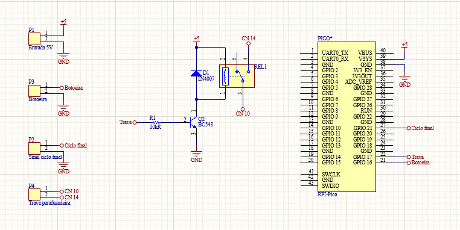
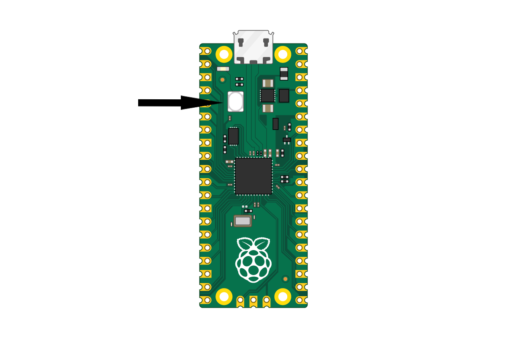

# Intertravamento da Parafusadeira
 
Esse projeto tende a resolver o seguinte problema: 
 
    Na linha de produção, o operador passa o dia parafusando um objeto, o mesmo tem que colocar 9 
    parafusos, após repetir o processo várias vezes no dia, ele esquece um e vai para o cliente 
    o produto com "defeito".
 
O projeto resolve o problema usando duas partes principais, uma parafusadeira que conta parafusos e um sistema para travar a parafusadeira e "forçar" o operador a clicar um botão.
 
A parafuseira utilizado é a SKP-BC40HL-800.
 
Para construção do intertravamento utilizamos os seguintes materiais:
 
    - Raspberry Pi Pico
    - Transitor (BC548)
    - Resistor 1k200R
    - Botoeira 
    - Rele 5V
    - Fonte 5V1A
    - 4 Conectores 2 vias
    - Conector Jack (Alimentação)
 
## Montagem 
 
Para o sistema funcionar criamos um placa junto com nosso microcontrolador.
 

 
Com a placa montada devemos entender como funciona a nossa parafusadeira, para isto deixo o PDF do manual da mesma. Mas para uso do nosso sitema explicarei quais portas devemos usar (estou assumindo que a parafusadeira já está configurada para contar até nove), está informação esta na pagina [10](http://folke-larsen.dk/info/vejledninger/75695V.pdf) do PDF.
 
    CN6~7: Sinal de saída
    CN10~14 Travamento da parafusadeira (Para funcionar precisa fechar um contato)
 
Com a placa montada conforme o circuito, podemos ligarmos os componentes externos no nossos conectores:
 
    Pino 16: botoeira  
    Pino 21: Sinal parafusadeira
    Pino 22: Trava parafusadeira
 
## Compilação do firmware 
 
Clone o projeto
 
```bash
  git clone https://github.com/kakasten/AjusteOnuDeReferencia
```
 
Instale Rust e Cargo
 
```bash
  curl https://sh.rustup.rs -sSf | sh
```
 
Instale elf2uf2-rs
 
```bash
  cargo install elf2uf2-rs --locked
```
 
Instale o destino thumbv6m-none-eabi
 
```bash
  rustup target add thumbv6m-none-eabi
```
 
Entre no diretório do projeto
 
```bash
  cd AjusteOnuDeReferencia
```
 
Compile o projeto e crie o .UF2
 
```bash
  cargo run
```
  
## Gravação do firmware 
 
Reset o Raspberry Pi Pico, para isso conecte o cabo USB ao seu computador e antes de conectar ao Raspberry Pi Pico, localize, pressione e segure o botão BOOTSEL (botão branco na placa). Após conectar o cabo USB, você pode soltar o botão BOOTSEL.
 

 
Arrastar o arquivo .UF2 para o espaço de armazenamento RPI-RP2. Para encontrar o arquivo. Você deve entrar no diretório no projeto e usar o seguinte comando:
 
```bash
  cd \target\thumbv6m-none-eabi\debug\
```
 
## Desenvolvedores
| [<br><sub>Kakasten</sub>](https://github.com/kakasten) |
| :---: |
 
